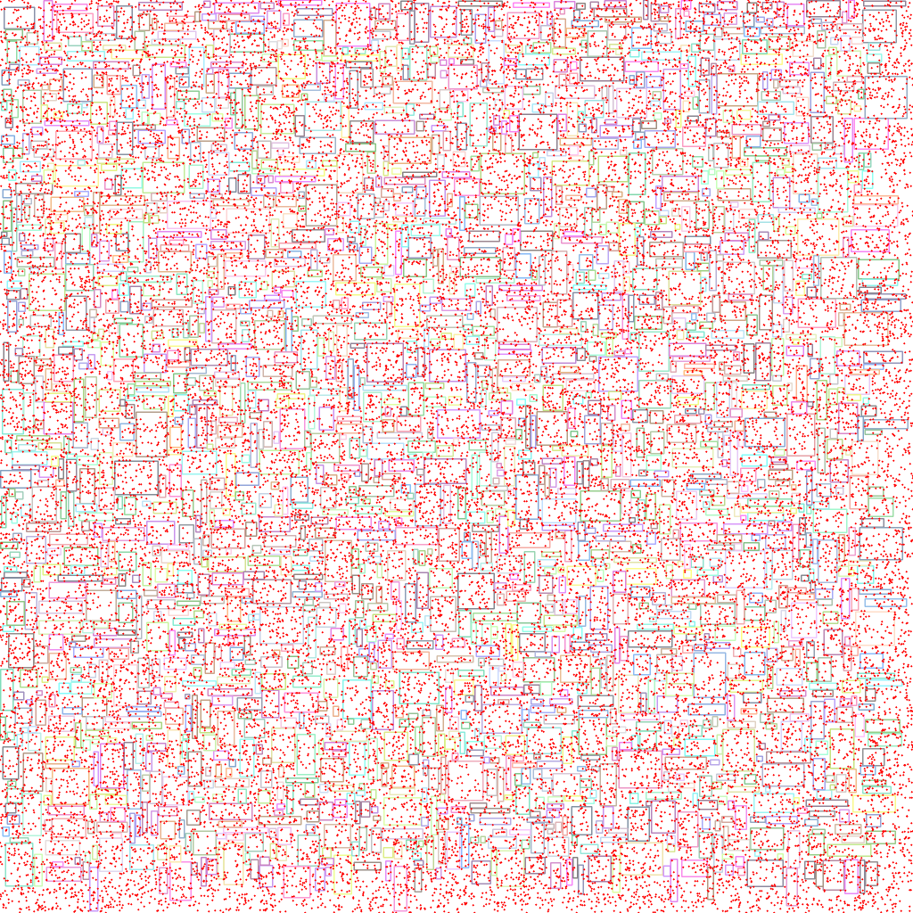

it's just a quadtree created to store 4 coal polygons representing cv::Point . 
and a quick check to see if the point falls into the polygon.


speed test
```
QuadTree insertion time: 0.784 ms
RTree insertion time: 1.036 ms
QuadTree query time: 147.2 ms
RTree query time: 10.438 ms
Brute Force query time: 1620.97 ms
Mismatches qt: 0
```

